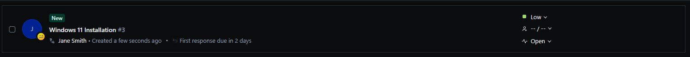

# TKT-001: New device requires Windows 11 installed before being issued to a user

**Status:** Resolved  
**Priority:** Low  
**System:** Freshdesk

---

## Resolution Steps
1. I used the Media Creation Tool to create a bootable Windows 11 USB
2. Next, I inserted it into the laptop and turned it on
3. following that I set the language and region settings to United Kingdom 
4. Finally, I skipped the product key and chose Windows 11 Pro as the edition

---

## Screenshots

