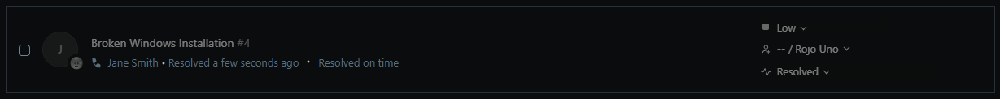

# TKT-002: User's PC fails to boot — automatic repair unsuccessful, manual recovery required

**Status:** Open  
**Priority:** High  
**System:** Freshdesk

---

## Resolution Steps
Numbered steps taken to resolve it — technical, first person, past tense.

---

## Outcome
One or two lines confirming what was done and that the ticket was closed.

---

## Screenshots

