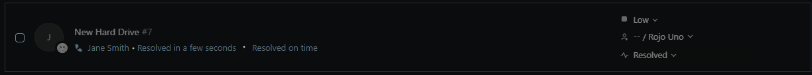

# TKT-003: Additional hard drive fitted to a workstation needs initialising and partitioning before use

**Status:** Open  
**Priority:** Low 
**System:** Freshdesk

---

## Resolution Steps
Numbered steps taken to resolve it — technical, first person, past tense.

---

## Screenshots

