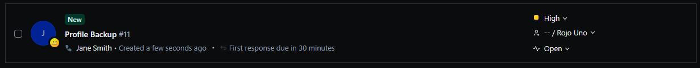
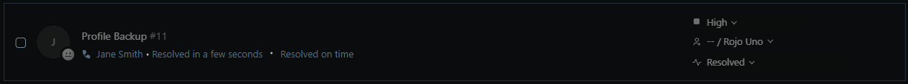

# TKT-007: User's profile needs to be backed up ahead of a device refresh

>**Note:** A shared drive already exists on the network so I didn't create another one here

**Status:** Open  
**Priority:** High  
**System:** Freshdesk

---

## Resolution Steps
1. Confirmed the shared backup folder exists and is accessible on the network
2. Advised the user to ensure all critical files were saved and no unsaved work was open
3. Opened Control Panel → Small Icons → Backup and Restore (Windows 7) → Set up backup → selected the shared folder as the destination → chose the user profile folder → ran backup
4. Navigated to the shared folder after completion and confirmed the backup archive was present

---

## Screenshots

