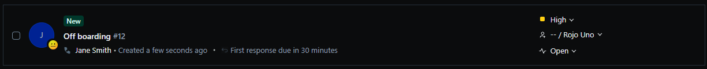
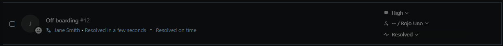

# TKT-008: User has left the organisation — profile to be removed from the device

**Status:** Resolved  
**Priority:** High  
**System:** Freshdesk

---

## Resolution Steps
1. Confirmed the username and device with the requester
2. Navigated to Settings → System → About → Advanced System Settings → Advanced → User Profiles → Settings
3. Selected the user profile from the list and clicked Delete to remove the profile data
4. Navigated to Settings → Accounts → Other Users, selected the account and clicked Remove to delete the user account

---

## Screenshots

