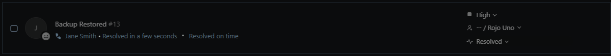

# TKT-009: User returning from leave needs their profile restored from backup

**Status:** Resolved 
**Priority:** High  
**System:** Freshdesk

---

## Resolution Steps
## Resolution Steps
1. Confirmed the username and the backup location with the requester
2. Opened Control Panel → Small Icons → Backup and Restore (Windows 7)
3. Selected Restore my files and browsed to the shared backup folder
4. Located the user's profile backup, selected the folder and clicked Add folder
5. Set the restore destination to original location and clicked Restore
6. Confirmed the profile folder was present under C:\Users and advised the user to log in and verify their files

---

## Screenshots

