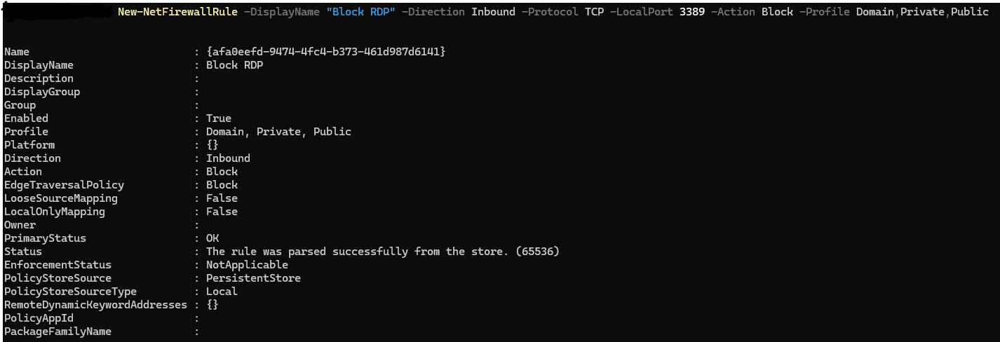
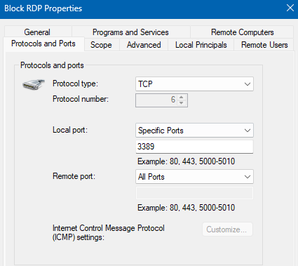

# TKT-013: New starter device requires RDP access disabled per security policy

**Status:** Resolved
**Priority:** Medium
**System:** Freshdesk

---

## Resolution Steps
1. Confirmed with the requester that RDP access was not required on this device per the standard security baseline
2. Created an inbound firewall rule via PowerShell to block RDP: `New-NetFirewallRule -DisplayName "Block RDP" -Direction Inbound -Protocol TCP -LocalPort 3389 -Action Block -Profile Domain,Private,Public`
3. Confirmed the rule was created correctly in Windows Defender Firewall with Advanced Security

---

## Screenshots

