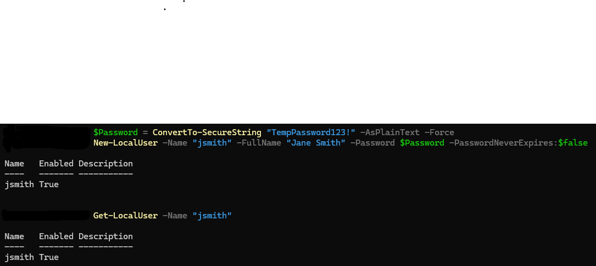
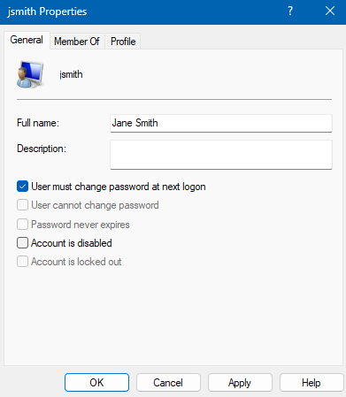

# TKT-014: New user account required with enforced password change on first login

**Status:** Resolved
**Priority:** Medium
**System:** Freshdesk

---

## Resolution Steps
1. Created the new user account via PowerShell with a temporary password: `New-LocalUser -Name "jsmith" -FullName "Jane Smith" -Password $Password`
2. Verified the account was created using `Get-LocalUser -Name "jsmith"`
3. Opened `lusrmgr.msc`, located the account, and ticked **User must change password at next logon** under Properties
4. Confirmed the setting was applied before handing the account over

---

## Screenshots

