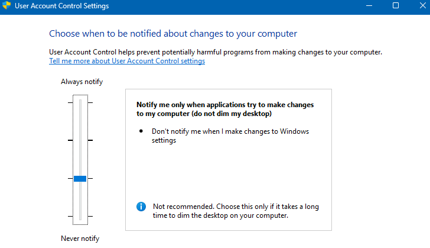

# TKT-015: User requests UAC level reduced due to repeated elevation prompts during routine work

**Status:** Resolved
**Priority:** Low
**System:** Freshdesk

---

## Resolution Steps
1. Opened User Account Control settings via the Start Menu
2. Reduced the notification level by one step on the slider
3. Confirmed the change with the user and advised that some elevation prompts will still appear for application-initiated changes

---

## Screenshots
