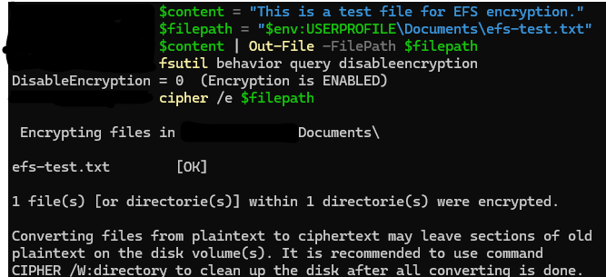
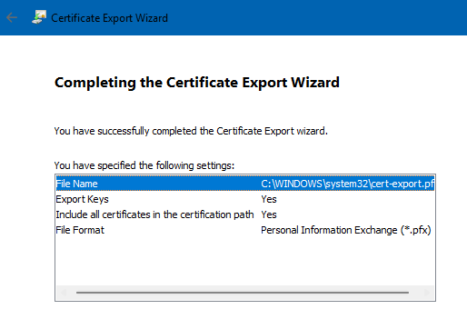

# TKT-016: User requests sensitive files be encrypted on local device

**Status:** Resolved
**Priority:** Medium
**System:** Freshdesk

---

## Resolution Steps
1. Created the target file in the user's Documents folder via PowerShell
2. Checked encryption was enabled at the system level using `fsutil behavior query disableencryption`
3. Encrypted the file using `cipher /e $filepath`
4. Opened `certmgr.msc`, located the newly generated EFS certificate under Personal → Certificates, and exported it including the private key to a secure backup location
5. Advised the user that the exported certificate must be kept safe, as losing it would make the encrypted file permanently unreadable

---

## Screenshots

