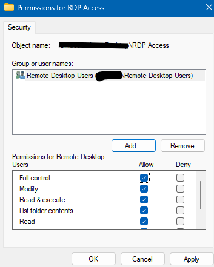

# TKT-017: Folder required that is only accessible to Remote Desktop Users

**Status:** Resolved
**Priority:** Medium
**System:** Freshdesk

---

## Resolution Steps
1. Created a folder named `RDP Access`
2. Opened folder Properties → Security tab → Edit, and set permissions for the **Remote Desktop Users** group
3. Removed all other groups from the permissions list, leaving only Remote Desktop Users with access
4. Added a test user to the Remote Desktop Users group and confirmed they could access the folder
5. Removed the test user from the group and confirmed access was denied

---

## Screenshots
