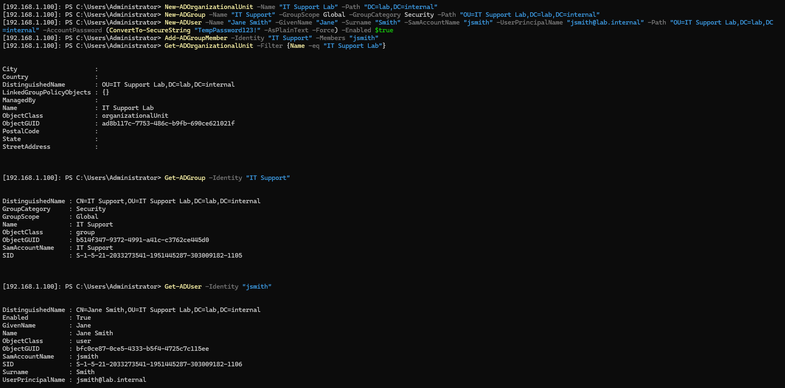

# Skill: Create OUs, Groups, and Users in Active Directory

---

## Remote Management Setup

### WinRM

WinRM (Windows Remote Management) is Microsoft's implementation of the WS-Management protocol — it allows PowerShell commands to be executed on a remote machine over the network. It needs to be running on both the local machine and the remote target for a session to be established.

Enable WinRM on the local machine by running the following in an elevated PowerShell prompt:

```powershell
winrm quickconfig
```

Then add the remote machine to the TrustedHosts list, since the host is not domain joined and Kerberos authentication is not available:

```powershell
Set-Item WSMan:\localhost\Client\TrustedHosts -Value "192.168.1.100"
```

---

### Enter-PSSession

`Enter-PSSession` opens an interactive remote PowerShell session on a target machine. Once connected, all commands typed run on the remote machine rather than locally — equivalent to sitting at the server's terminal.

```powershell
Enter-PSSession -ComputerName 192.168.1.100 -Credential lab.internal\Administrator
```

| Parameter | Description |
|-----------|-------------|
| `-ComputerName` | IP address or hostname of the remote machine |
| `-Credential` | The account to authenticate with — format is `domain\username` |

Once connected, the prompt changes to confirm the remote session is active:

```
[192.168.1.100]: PS C:\Users\Administrator\Documents>
```

To exit the session:

```powershell
Exit-PSSession
```

---

## Creating an OU

An Organisational Unit (OU) is a container within Active Directory used to organise users, groups, computers, and other objects. OUs are also the level at which Group Policy Objects (GPOs) are linked and applied.

```powershell
New-ADOrganizationalUnit -Name "IT Support Lab" -Path "DC=lab,DC=internal"
```

---

## Creating a Group

```powershell
New-ADGroup -Name "IT Support" -GroupScope Global -GroupCategory Security -Path "OU=IT Support Lab,DC=lab,DC=internal"
```

| Parameter | Description |
|-----------|-------------|
| `-GroupScope` | `Global` groups are used within a single domain and can be added to other groups or assigned permissions |
| `-GroupCategory` | `Security` groups are used to assign permissions; `Distribution` groups are used for email distribution lists |

---

## Creating a User

```powershell
New-ADUser -Name "Jane Smith" `
  -GivenName "Jane" `
  -Surname "Smith" `
  -SamAccountName "jsmith" `
  -UserPrincipalName "jsmith@lab.internal" `
  -Path "OU=IT Support Lab,DC=lab,DC=internal" `
  -AccountPassword (ConvertTo-SecureString "TempPassword123!" -AsPlainText -Force) `
  -Enabled $true
```

---

## Adding a User to a Group

```powershell
Add-ADGroupMember -Identity "IT Support" -Members "jsmith"
```

---

## Verifying

```powershell
Get-ADOrganizationalUnit -Filter {Name -eq "IT Support Lab"}
Get-ADGroup -Identity "IT Support"
Get-ADUser -Identity "jsmith"
```

---

## Related Ticket

→ [TKT-021: New starter requires Active Directory account created and added to relevant group](../tickets/TKT-022.md)

---

## Screenshots

