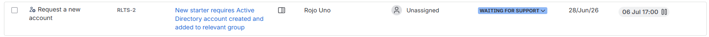
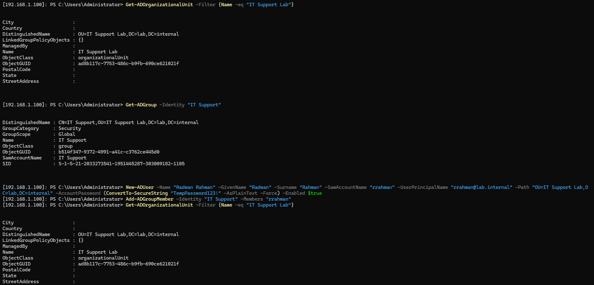
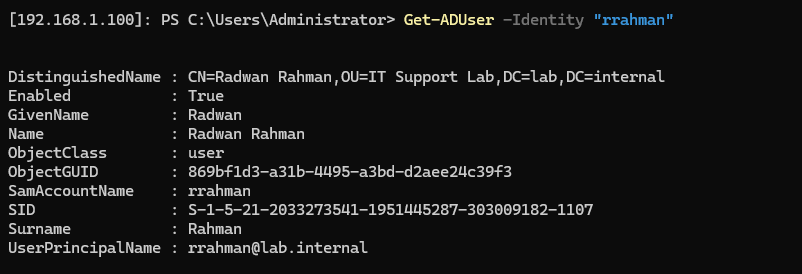
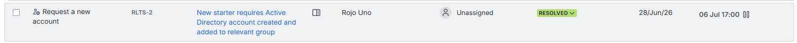

# TKT-021: New starter requires Active Directory account created and added to relevant group

**Status:** Resolved
**Priority:** Medium
**System:** Jira Service Management

---

## Resolution Steps
1. Remote into the domain controller using `Enter-PSSession -ComputerName 192.168.1.100 -Credential lab.internal\Administrator`
2. Confirmed the target OU and group existed using `Get-ADOrganizationalUnit` and `Get-ADGroup`
3. Created the user account using `New-ADUser` with a temporary password
4. Added the user to the relevant group using `Add-ADGroupMember`
5. Verified the account was created and group membership confirmed using `Get-ADUser`

---

## Screenshots

