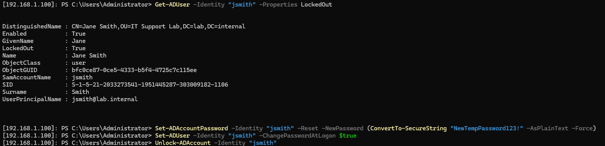
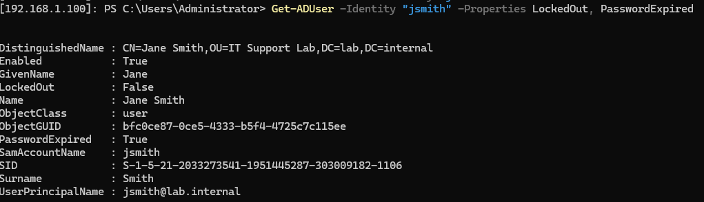

# TKT-022: User account locked out and password reset required

**Status:** Resolved
**Priority:** High
**System:** Jira Service Management

---

## Resolution Steps
1. Remote into the domain controller using `Enter-PSSession -ComputerName 192.168.1.100 -Credential lab.internal\Administrator`
2. Confirmed the account was locked using `Get-ADUser -Identity "jsmith" -Properties LockedOut`
3. Reset the account password using `Set-ADAccountPassword -Identity "jsmith" -Reset -NewPassword (ConvertTo-SecureString "NewTempPassword123!" -AsPlainText -Force)`
4. Forced a password change at next logon using `Set-ADUser -Identity "jsmith" -ChangePasswordAtLogon $true`
5. Unlocked the account using `Unlock-ADAccount -Identity "jsmith"`
6. Confirmed account status using `Get-ADUser -Identity "jsmith" -Properties LockedOut, PasswordExpired`

---

## Screenshots

